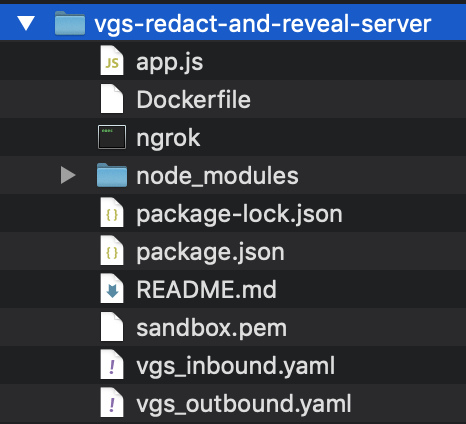

# Example Node.js Server for VGS INBOUND and OUTBOUND routes

## Steps to run and test

Please make sure by the end of the setup, you have a similar repo layout as the image below.


1. Download and include the `sandbox.pem` from your vault from the `Code snippets` link within the base directory with the `app.js` file.

2. Populate the `.env` within the base directory with the `app.js` file.
```
VGS_INBOUND_PROXY=https://<tenantID>.SANDBOX.verygoodproxy.com/post
VGS_OUTBOUND_PROXY=http://<tenantID>.SANDBOX.verygoodproxy.com
SERVER_UPSTREAM_HOST=https://<ngrokID>.ngrok.io/reveal
VGS_PROXY_AUTH=<userID>:<password>
REDACT_PAYLOAD=testing123
NODE_EXTRA_CA_CERTS=sandbox.pem
```

3. Upload the INBOUND `vgs_inbound.yaml` and OUTBOUND `vgs_outbound.yaml` files. VGS route to redact on the INBOUND uses the filter pathInfo of `/post` on the testing echo server `https://echo.apps.verygood.systems` (recommended only for testing purposes). The OUTBOUND route uses pathInfo `/reveal` in order to echo back the revealed payload value for test on the Node server you setup.

4. Update your upstream

SERVER_UPSTREAM_HOST should be changed to the address of your server. To test with this server, you will also require an outbound route on your VGS vault pointing to your server's address. For local development, we typically use [NGROK](https://ngrok.com).

> Update the upstream host for the OUTBOUND route. It is currently set with the temporary external upstream of `https://<ngrokID>.ngrok.io`.

> Update your endpoint from `/reveal` if you are using another endpoint to echo back on your server. See `app.js` for the `/reveal` endpoint.

5. Build the Docker container. Don't add `-d` in detached mode to your `docker run` command or you won't see the server output.
```
docker build -t app .
docker run -p 3000:3000 app:latest
```

6. Test the routes.

Visit `localhost:3000/start` in your browser to test. You can see from the server side as the payload is redacted and revealed.

Response from Axios request on REDACT:
```
{
  args: {},
  data: '{"test":"tok_sandbox_qgA7e3RBUg4SJVPmHBFDBF"}',
  files: {},
  form: {},
  headers: {
    Accept: 'application/json, text/plain, */*',
    Connection: 'close',
    'Content-Length': '45',
    'Content-Type': 'application/json',
    Host: 'echo.apps.verygood.systems',
    'User-Agent': 'axios/0.20.0',
    'Vgs-Request-Id': '716a4fc300aadd33ede29310db52fa4d',
    'Vgs-Tenant': '<tenantID>',
    'X-Forwarded-Host': '<tenantID>.sandbox.verygoodproxy.com'
  },
  json: { test: 'tok_sandbox_qgA7e3RBUg4SJVPmHBFDBF' },
  origin: '98.37.37.133, 52.72.130.32, 34.194.18.145, 10.22.83.203',
  url: 'https://echo.apps.verygood.systems/post'
}
```

Response from Axios request on REVEAL:
```
{ test: 'testing123' }
```


